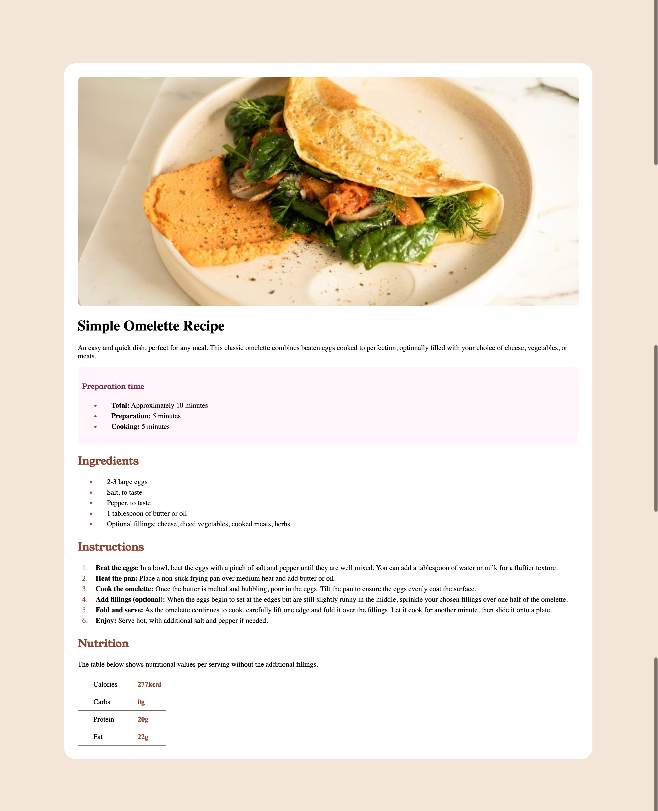

# Frontend Mentor - Recipe page solution

This is a solution to the [Recipe page challenge on Frontend Mentor](https://www.frontendmentor.io/challenges/recipe-page-KiTsR8QQKm). This challenge helped me improve my coding skills by building a realistic project.

## Table of contents

- [Overview](#overview)
  - [The challenge](#the-challenge)
  - [Screenshot](#screenshot)
- [My process](#my-process)
  - [Built with](#built-with)
  - [What I learned](#what-i-learned)
  - [Continued development](#continued-development)
  - [Useful resources](#useful-resources)
- [Author](#author)
- [Acknowledgments](#acknowledgments)

## Overview

### The challenge
Create a recipe page that is responsive and visually appealing while adhering to specified design guidelines.

### Screenshot




<!-- - Live Site URL: [Add live site URL here](https://your-live-site-url.com) -->

## My process

### Built with

- Semantic HTML5 markup
- CSS custom properties
- Mobile-first workflow
- [Young Serif](https://fonts.google.com/specimen/Young+Serif) for body text
- [Outfit](https://fonts.google.com/specimen/Outfit) for headings

### What I learned

During this project, I learned how to:
- Use semantic HTML for better accessibility.
- Apply CSS Flexbox for layout adjustments.
- Ensure responsiveness with media queries.
- Customize styles using HSL color values.

```html
<h1>Simple Omelette Recipe</h1>

<!-- ### Links

- Live Site URL: [Add live site URL here](https://your-live-site-url.com) -->

```html
<h1>Some HTML code I'm proud of</h1>
```
```css
.proud-of-this-css {
  color: bisque;
}
```
```js
const proudOfThisFunc = () => {
  console.log('🎉')
}
```

### Continued development

In future projects, I want to focus on:

- Improving my understanding of CSS Grid/Flex.
- Enhancing my JavaScript skills for interactivity.


### Useful resources

- [Example resource 1](https://developer.mozilla.org/en-US/docs/Web/CSS) - This helped me for understanding and revising the important concepts related the project. I really recommend to everyone!


## Author

- Website - [rusdev](https://github.com/rkodirkhonov)
- Frontend Mentor - [@rkodirkhonov](https://www.frontendmentor.io/profile/rkodirkhonov)
